# Referee Tournament Dashboard UI/UX Specification

This document defines the user experience goals, information architecture, user flows, and visual design specifications for the **Referee Tournament Dashboard**. It serves as the foundation for visual design and frontend development, ensuring a cohesive and referee-centered experience optimized for outdoor tournament conditions.

## Unique Design Challenge

Unlike typical mobile applications, this interface must excel in **high-glare, outdoor environments** where referees need **instant access to critical tournament information**. The design prioritizes **legibility, speed, and reliability** over aesthetic appeal.

## UX Goals & Principles

### Target User Personas

**Primary Persona: Tournament Referee**
- **Role:** Beach volleyball official managing multiple matches during tournament days
- **Technical Comfort:** Moderate - familiar with basic mobile apps but values simplicity
- **Physical Context:** Standing/moving in bright sunlight, potentially wearing sunglasses, may have wet or sandy hands
- **Primary Goals:** 
  - Quickly check current match assignments
  - View match schedules and court locations
  - Access match results and tournament status
  - Confirm referee assignments and timing

### Usability Goals
- **Instant Recognition:** Referee can identify their current assignment within 3 seconds of opening app
- **One-Handed Operation:** All critical functions accessible with single thumb interaction
- **Sunlight Legibility:** All text remains readable in direct sunlight conditions
- **Speed Priority:** Core information loads in under 2 seconds
- **Error Prevention:** Clear confirmation for any data entry or status changes

### Design Principles
1. **Visibility First** - Maximum contrast and large fonts take priority over aesthetics
2. **Essential Information Only** - Show only what referees need for current/next matches
3. **Touch-Optimized** - Large touch targets (minimum 44px) for outdoor conditions
4. **Status-Driven Design** - Clear visual indicators for match states and referee assignments
5. **Consistent Navigation** - Same interaction patterns throughout to reduce cognitive load

## Information Architecture

### Site Map: State-Based Navigation

```mermaid
graph TD
    A[🏐 App Launch] --> B{User State Check}
    
    B -->|New User| C[🎯 Tournament Selection]
    B -->|Returning User| D[📍 Referee Dashboard]
    
    C --> E[👆 Tap Tournament Card]
    E --> F[📋 Tournament Detail View]
    
    F --> F1[📊 Tournament Info Card]
    F --> F2[🔄 "Switch to this Tournament" Button]
    
    F2 --> G[Tournament Selected & Saved ✓]
    G --> D[📍 Referee Dashboard]
    
    D --> H[📍 My Assignments Tab]
    D --> I[📊 Match Results Tab] 
    D --> J[🏆 Tournament Tab]
    D --> K[⚙️ Settings Tab]
    
    J --> J1[📊 Same Tournament Info Card]
    J --> J2[🏃‍♀️ Live Tournament Status]
    
    K --> K1[🎨 Display Preferences]
    K --> K2[🔔 Notifications]
```

### Navigation Structure

**State 1: No Tournament Selected**
- **Full-screen tournament selection** (reuses existing tournament list component)
- **No bottom navigation bar** - clean, focused experience
- **Large, touch-friendly tournament cards** optimized for outdoor viewing

**State 2: Tournament Selected**
- **Bottom tab bar appears** with 4 sections: My Assignments, Results, Tournament, Settings
- **Tournament name prominently displayed** in header
- **All referee-specific features enabled**

**Persistent State Management:**
- **localStorage/AsyncStorage** saves last selected tournament
- **Auto-resume** to referee dashboard on app reopen
- **Tournament switching** always available in Tournament tab

## User Flows - Referee-Specific Features

### User Flow 1: Check My Assignments (Read-Only)

**User Goal:** View referee assignments - NO editing capabilities

**Entry Points:** App launch (returning user), "My Assignments" tab

**Success Criteria:** Referee can identify their assignments and status within 3 seconds

```mermaid
graph TD
    A[📱 Open App] --> B[📅 My Assignments]
    
    B --> C[🔜 Current/Next Assignment - Large]
    B --> D[📝 Remaining Assignments List]
    
    C --> C1[⏰ Match Time]
    C --> C2[👥 Team Names]
    C --> C3[⚽ Court Assignment (from system)]
    C --> C4[📊 Match Status]
    
    D --> D1[📊 Assignment 2: Time, Teams, Court]
    D --> D2[📊 Assignment 3: Time, Teams, Court]
    
    C --> E[👆 Tap for Details]
    E --> F[📋 Assignment Detail View]
```

### User Flow 2: View Match Results (Read-Only)

**User Goal:** Check scores and results of completed matches

**Entry Points:** "Results" tab, checking tournament progress

**Success Criteria:** Clear display of match outcomes with scores

```mermaid
graph TD
    A[📊 Results Tab] --> B[📋 Match Results List]
    
    B --> C[🔴 Live Matches Section]
    B --> D[✅ Completed Matches Section]
    
    C --> C1[⏳ Live: Team A vs Team B]
    C --> C2[📊 Current Score: 15-12, 8-6]
    
    D --> D1[🏐 Final: Team C vs Team D]
    D --> D2[🏆 Score: 21-15, 18-21, 15-12]
    
    C --> E[👆 Tap Live Match]
    D --> F[👆 Tap Completed Match]
    
    E --> G[📋 Live Match Details]
    F --> H[📋 Final Result Details]
```



### User Flow 3: Smart Notifications

**Trigger:** Previous match starts playing (perfect timing indicator)

**User Goal:** Get notified when it's almost time for assignment

```mermaid
graph TD
    A[⏳ Previous Match Starts] --> B[⏱️ System Detects Match Start]
    
    B --> C[📱 Push Notification Sent]
    C --> C1[🔔 "Your match is up next!"]
    C --> C2[⚽ "Court X in ~30 minutes"]
    C --> C3[👥 "Team A vs Team B"]
    
    C --> D[👆 Tap Notification]
    D --> E[📅 Jump to Assignment Details]
```

## Screen Layouts

### Screen 1: Tournament Selection (New Users)
- **Full-screen tournament list** (reusing existing TournamentList component)
- **Large tournament cards** with high contrast design
- **Search functionality** for past/upcoming tournaments
- **No bottom navigation bar** - focused experience

### Screen 2: Tournament Detail/Confirmation
- **Tournament info card** (identical to Tournament tab)
- **Large "Switch to this Tournament" button** 
- **Back navigation** to tournament list
- **Tournament metadata** (dates, location, status)

### Screen 3: Referee Dashboard - My Assignments (Read-Only)
- **Current Assignment Card - Extra Large Display**
  - Court number (received from tournament system)
  - Team names (clear, high contrast)
  - Match time (prominent)
  - Match status (upcoming/active/completed)
- **Upcoming assignments list** (read-only cards)
- **Completed assignments** (grayed out, for reference)

### Screen 4: Match Results (Read-Only)
- **Live matches section** (in-progress scores)
- **Completed matches list** (final results)
- **Score display** with set-by-set breakdown
- **Match metadata** (court, duration, teams)

### Screen 5: Tournament Info (Read-Only)
- **Tournament info card** (same as selection screen)
- **Overall tournament status** (rounds, progress)
- **General announcements** (weather, delays)
- **Switch tournament** functionality

### Screen 6: Settings (Personal Preferences Only)
- **Display Settings**
  - High contrast mode toggle
  - Font size (Large/XL/Maximum)
  - Color scheme selection
  - Screen brightness preferences
- **Notification Preferences**
  - Enable/disable assignment notifications
  - Notification timing settings
  - Sound/vibration controls

## Component Library & Design System

### Design System Approach
**Foundation: Outdoor Sports Visibility System**
- Built specifically for **sunlight readability** and **quick information scanning**
- **Status-first design** - every component communicates current state clearly
- **Touch-optimized** - large hit targets for outdoor conditions

### Core Components

#### Assignment Card
- **Current Assignment (Hero)** - Extra large, high prominence
- **Upcoming Assignment** - Standard size, clear hierarchy  
- **Completed Assignment** - Muted styling, reference only
- **States:** Active, Upcoming, Completed, Cancelled

#### Match Result Card
- **Live Match** - In-progress with current scores
- **Completed Match** - Final results with set breakdown
- **States:** Live, Final, Scheduled, Cancelled

#### Tournament Info Panel
- **Consistent tournament information display** across screens
- **States:** Active, Upcoming, Completed, Cancelled

#### Status Indicators
- **Color coding:** Active (Green), Upcoming (Blue), Completed (Gray), Cancelled (Red)
- **High contrast ratios** for outdoor visibility
- **Icon + text combinations** for accessibility

## Branding & Style Guide

### Visual Identity
**Brand Guidelines:** Professional Referee Tool - authoritative, reliable, efficient, outdoor-optimized

### Color Palette

| **Color Type** | **Hex Code** | **Usage** |
|----------------|--------------|-----------|
| **Primary** | #1B365D | Navigation, headers, court numbers |
| **Secondary** | #4A90A4 | Supporting elements, borders |
| **Accent** | #FF6B35 | Call-to-action buttons, active states |
| **Success** | #2E8B57 | Active/live match indicators |
| **Warning** | #FF8C00 | Upcoming assignments, alerts |
| **Error** | #C41E3A | Cancelled matches, critical alerts |
| **Text Primary** | #2C3E50 | Primary text, headings |
| **Text Secondary** | #7F8C8D | Secondary text, metadata |
| **Background** | #FFFFFF | Card backgrounds, primary surfaces |

### Typography

| **Element** | **Size** | **Weight** | **Usage** |
|-------------|----------|------------|-----------|
| **Hero** | 40px | Bold | Current court number display |
| **H1** | 32px | Bold | Screen titles, primary headings |
| **H2** | 24px | Semibold | Section headers, team names |
| **Body Large** | 18px | Regular | Primary content, assignment details |
| **Body** | 16px | Regular | Standard text, general information |
| **Caption** | 14px | Medium | Metadata, timestamps, status text |

**Font Family:** SF Pro (iOS) / Roboto (Android) - System fonts for guaranteed readability

### Iconography
- **Library:** SF Symbols (iOS) / Material Design Icons (Android)
- **Style:** Outlined for better outdoor visibility
- **Size:** 24px minimum, 32px preferred
- **Core Icons:** 🏐 ⚽ ⏰ 👥 📊 🔔 ⚙️ 🔄 ✅ 🟢

### Spacing & Layout
- **Grid System:** 8px base unit
- **Touch Targets:** 44px minimum, 56px preferred
- **Content Margins:** 16px minimum from screen edges

## Accessibility Requirements

### Compliance Target
**Standard:** WCAG 2.1 AA compliance with AAA color contrast (7:1) for outdoor visibility

### Key Requirements
**Visual:**
- Color contrast ratios: 7:1 minimum for all text-background combinations
- Focus indicators: 4px outline with high contrast color
- Text sizing: Minimum 12px, scalable to 200%

**Interaction:**
- Keyboard navigation: Full app accessible via external keyboard
- Screen reader support: Complete VoiceOver/TalkBack compatibility
- Touch targets: 44px minimum hit area, 56px preferred

**Content:**
- Alternative text: Descriptive alt text for all icons and status indicators
- Heading structure: Proper H1-H3 hierarchy for screen reader navigation
- Form labels: All interactive elements have accessible names and roles

## Responsiveness Strategy

### Breakpoints
| **Breakpoint** | **Min Width** | **Max Width** | **Target Devices** |
|----------------|---------------|---------------|--------------------|
| **Mobile** | 320px | 767px | iPhone SE to iPhone Pro Max |
| **Tablet** | 768px | 1024px | iPad, Android tablets |
| **Desktop** | 1025px | - | Desktop browsers (limited use) |

### Adaptation Patterns
- **Layout Changes:** Single-column mobile-first design scales up to wider cards on tablets
- **Navigation Changes:** Bottom tab navigation on mobile, side navigation on tablet landscape
- **Content Priority:** Current assignment always prominently displayed
- **Touch Targets:** Remain large across all breakpoints

## Animation & Micro-interactions

### Motion Principles
Minimal, purposeful animation focused on status communication and feedback. Respects prefers-reduced-motion accessibility setting.

### Key Animations
- **Live Match Pulse:** Subtle 2-second pulse on live match indicators
- **Card Touch Feedback:** 0.1s scale and shadow change on touch
- **Data Refresh Spinner:** Standard loading indicator during API calls
- **Status Transition:** Color fade when assignment status changes

## Performance Considerations

### Performance Goals
- **Page Load:** Under 2 seconds on 3G connection
- **Interaction Response:** Under 100ms for all tap interactions
- **Animation FPS:** Consistent 60fps for all micro-interactions

### Design Strategies
Image optimization for tournament logos, lazy loading for match results lists, aggressive caching of assignment data, minimal JavaScript for core functionality

## Next Steps

### Immediate Actions
1. Create high-fidelity mockups for all core screens in design tool
2. Test color contrast in actual outdoor sunlight conditions
3. Validate component library with referee user testing
4. Develop interaction prototypes for main user flows
5. Create design handoff documentation for development team

### Design Handoff Checklist
- [x] All user flows documented
- [x] Component inventory complete  
- [x] Accessibility requirements defined
- [x] Responsive strategy clear
- [x] Brand guidelines incorporated
- [x] Performance goals established

---

## Summary

This specification defines a **read-only referee interface** optimized for **outdoor tournament conditions** with focus on:

✅ **Maximum sunlight visibility** through high-contrast design  
✅ **Referee-specific workflows** for assignments and results  
✅ **Progressive tournament selection** with state-based navigation  
✅ **Touch-optimized interactions** for outdoor use conditions  
✅ **Professional branding** appropriate for referee tools  
✅ **Comprehensive accessibility** including outdoor visibility needs

The design prioritizes **information consumption speed** and **outdoor usability** over aesthetic complexity, creating a professional tool that serves referees efficiently during active tournaments.

**Ready for visual design creation and development handoff.**