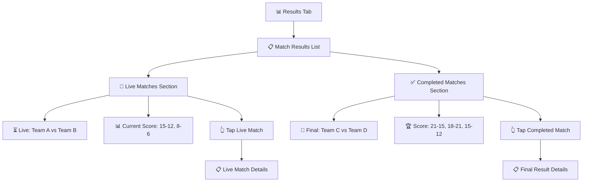

# User Flows - Referee-Specific Features

## User Flow 1: Check My Assignments (Read-Only)

**User Goal:** View referee assignments - NO editing capabilities

**Entry Points:** App launch (returning user), "My Assignments" tab

**Success Criteria:** Referee can identify their assignments and status within 3 seconds

```mermaid
graph TD
    A[📱 Open App] --> B[📅 My Assignments]
    
    B --> C[🔜 Current/Next Assignment - Large]
    B --> D[📝 Remaining Assignments List]
    
    C --> C1[⏰ Match Time]
    C --> C2[👥 Team Names]
    C --> C3[⚽ Court Assignment (from system)]
    C --> C4[📊 Match Status]
    
    D --> D1[📊 Assignment 2: Time, Teams, Court]
    D --> D2[📊 Assignment 3: Time, Teams, Court]
    
    C --> E[👆 Tap for Details]
    E --> F[📋 Assignment Detail View]
```

## User Flow 2: View Match Results (Read-Only)

**User Goal:** Check scores and results of completed matches

**Entry Points:** "Results" tab, checking tournament progress

**Success Criteria:** Clear display of match outcomes with scores



## User Flow 3: Smart Notifications

**Trigger:** Previous match starts playing (perfect timing indicator)

**User Goal:** Get notified when it's almost time for assignment

```mermaid
graph TD
    A[⏳ Previous Match Starts] --> B[⏱️ System Detects Match Start]
    
    B --> C[📱 Push Notification Sent]
    C --> C1[🔔 "Your match is up next!"]
    C --> C2[⚽ "Court X in ~30 minutes"]
    C --> C3[👥 "Team A vs Team B"]
    
    C --> D[👆 Tap Notification]
    D --> E[📅 Jump to Assignment Details]
```
